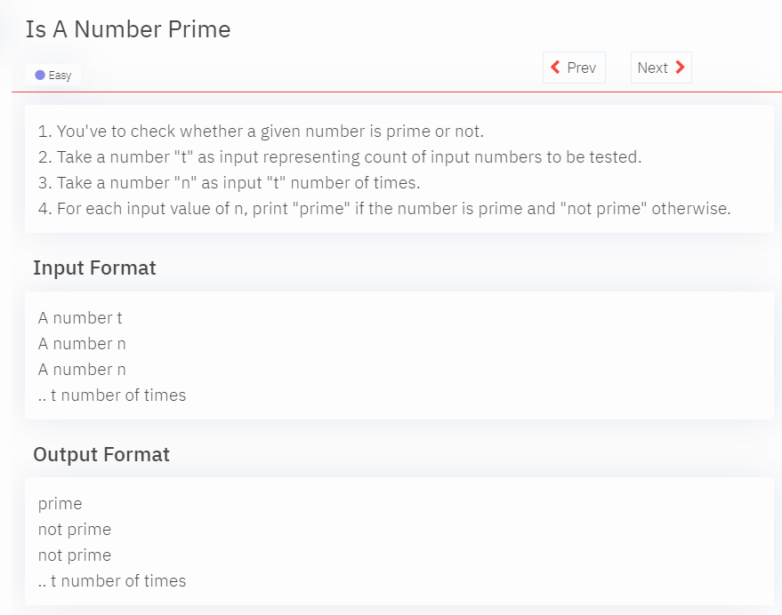

# Getting Started

[Prime](#prime)

## Prime

<details>
<summary>Quetion</summary>

</details>

<details>
<summary>Approach</summary>
- divide with 2 if the remainder is 0 then prime otherwise not prime
- optimization: instead of 
</details>

```java
import java.util.*;

    public class Main {

        public static void main(String[] args) {
            Scanner scn = new Scanner(System.in);

            int n;

            int t = scn.nextInt();
            for (int i = 0; i < t; i++) {
                n = scn.nextInt();
                boolean flag = false;
                for (int div = 2; div * div <= n; div++) {
                    if (n % div == 0) {
                        flag = true;
                        break;
                    }
                }

                if (flag) {
                    System.out.println("not prime");
                }else {
                    System.out.println("prime");
                }
            }
        }
    }
```
